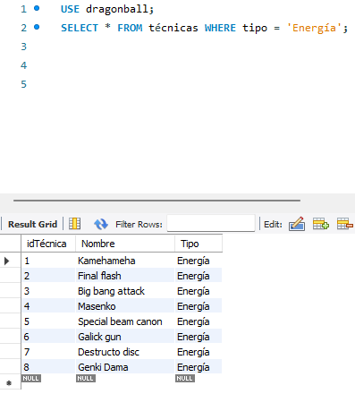

# Base de Datos de Dragon Ball Z

Este proyecto contiene una base de datos que almacena información relacionada con personajes, combates, objetos, organizaciones, películas, planetas, razas, sagas, transformaciones y técnicas de la serie Dragon Ball.

## Requerimientos

- MySQL o cualquier base de datos compatible con SQL.

## Tablas

Las siguientes tablas están definidas en la base de datos:

1. `combates`
2. `objetos`
3. `organizaciones`
4. `películas`
5. `personajes`
6. `planetas`
7. `raza`
8. `sagas`
9. `transformaciones`
10. `técnicas`

## Consultas SQL

A continuación se mostrarán consultas SQL con los resultados de cada consulta.


### 1. Seleccionar todos los combates ganados por Goku:

```sql
SELECT * FROM combates WHERE ganador = 'Goku'; 
```


### 2. Mostrar todas las organizaciones de tipo militar:

```sql
SELECT * FROM organizaciones WHERE tipo LIKE '%Militar%';
```


### 3. Obtener los objetos mágicos:

```sql
SELECT * FROM objetos WHERE tipo = 'Mágico';
```


### 4. Listar todas las películas lanzadas después del año 2000:

```sql
SELECT * FROM películas WHERE año > 2000;
```


### 5. Mostrar todos los personajes Saiyans:

```sql
SELECT * FROM personajes WHERE Raza_idRaza = 1;
```


### 6. Contar el número de planetas habitables:

```sql
SELECT COUNT(*) FROM planetas WHERE tipo = 'Habitable';
```


### 7. Mostrar todas las transformaciones de los Saiyans:

```sql
SELECT * FROM transformaciones WHERE Raza_idRaza = 1;
```


### 8. Obtener todas las técnicas de energía:

```sql
SELECT * FROM técnicas WHERE tipo = 'Energía';
```


### 9. Listar las sagas donde Freezer es el villano:

```sql
SELECT * FROM sagas WHERE villano = 'Freezer';
```


### 10. Mostrar todas las razas divinas:

```sql
SELECT * FROM raza WHERE nombre LIKE '%Dioses%';
```


### 11. Mostrar el último combate registrado de Vegeta:

```sql
SELECT * FROM combates WHERE ganador = 'Vegeta' ORDER BY id DESC LIMIT 1;
```


### 12. Contar cuántas veces ha peleado Goku contra Freezer:

```sql
SELECT COUNT(*) FROM combates WHERE combatientes LIKE '%Goku%' AND combatientes LIKE '%Freezer%';
```


### 13. Listar los objetos tecnológicos:

```sql
SELECT * FROM objetos WHERE tipo = 'Tecnológico';
```


### 14. Mostrar todas las películas protagonizadas por Broly:

```sql
SELECT * FROM películas WHERE nombre LIKE '%Broly%';
```


### 15. Mostrar los personajes asociados a los guerros Z:

```sql
SELECT * FROM personajes WHERE organizacion_id = (SELECT id FROM organizaciones WHERE nombre = 'Guerreros Z');
```


### 16. Obtener la lista de combates empatados:

```sql
SELECT * FROM combates WHERE ganador = 'Empate';
```


### 17. Mostrar todas las transformaciones de los Saiyajins:

```sql
SELECT transformaciones.idTransformación, transformaciones.nombre, raza.nombre
FROM transformaciones
INNER JOIN raza ON transformaciones.Raza_idRaza = raza.idRaza
WHERE transformaciones.nombre LIKE '%saiyajin%';
```


### 18. Listar las técnicas de fusión:

```sql
SELECT * FROM técnicas WHERE tipo = 'Fusión';
```


### 19. Mostrar los planetas con el número de habitantes superior a 70:

```sql
SELECT * FROM planetas WHERE habitantes > 70;
```


### 20. Listar las sagas en las que aparece Piccolo como villano:

```sql
SELECT * FROM sagas WHERE villano LIKE '%Piccolo%';
```


### 21. Contar las películas con la palabra "Saiyajin" en su nombre:

```sql
SELECT COUNT(*) FROM películas WHERE título LIKE '%Saiyajin%';
```


### 22. Mostrar los objetos que son armas:

```sql
SELECT * FROM objetos WHERE tipo = 'Arma';
```


### 23. Listar los combates donde participaron personajes de raza Saiyan:

```sql
SELECT * FROM combates WHERE ganador IN (SELECT nombre FROM personajes WHERE Raza_idRaza = 1);
```


### 24. Mostrar todas las técnicas de los personajes de raza Majin:

```sql
SELECT transformaciones.idTransformación, transformaciones.nombre, raza.nombre
FROM transformaciones
INNER JOIN raza ON transformaciones.Raza_idRaza = raza.idRaza
WHERE raza.nombre LIKE '%majin%';
```


### 25. Obtener el total de películas lanzadas entre 1990 y 2000:

```sql
SELECT COUNT(*) FROM películas WHERE año BETWEEN 1990 AND 2000;
```


### 26. Mostrar todos los personajes que han formado parte de la Capsule Corporation:

```sql
SELECT * FROM personajes WHERE organizacion_id = (SELECT id FROM organizaciones WHERE nombre = 'Capsule Corporation');
```


### 27. Mostrar las transformaciones que requieren entrenamiento:

```sql
SELECT * FROM transformaciones WHERE requisitos LIKE '%entrenamiento%';
```


### 28. Listar las películas antes de 1990:

```sql
SELECT * FROM películas WHERE año < 1990;
```


### 29. Mostrar los planetas destruidos o devastados:

```sql
    SELECT * FROM planetas WHERE tipo = 'Devastado';
```


### 30. Contar cuántas sagas han tenido como villano a un androide:

```sql
SELECT COUNT(*) FROM sagas WHERE villano LIKE '%Androide%';
```


### 31. Obtener todas las transformaciones con un aumento en poder:

```sql
SELECT * FROM transformaciones WHERE efectos LIKE '%aumento%';
```


### 32. Listar los combates en los que participó Jiren:

```sql
SELECT * FROM combates WHERE combatientes LIKE '%Jiren%';
```


### 33. Mostrar las técnicas de destrucción:

```sql
SELECT * FROM técnicas WHERE tipo = 'Destrucción';
```


### 34. Listar todos los personajes que hayan peleado en más de 2 combates:

```sql
SELECT nombre, COUNT(*) AS total_combates 
FROM personajes p 
JOIN combates c ON p.nombre = c.ganador 
GROUP BY nombre 
HAVING total_combates > 2;
```


### 35. Mostrar todas las técnicas de ki:

```sql
SELECT * FROM técnicas WHERE tipo = 'Ki';
```


### 36. Listar los personajes que pertenecen a la raza Freezer Race:

```sql
SELECT * FROM personajes WHERE Raza_idRaza = (SELECT idRaza FROM raza WHERE nombre = 'Freezer Race');
```


### 37. Mostrar todas las sagas en las que aparece Goku black como villano:

```sql
SELECT * FROM sagas WHERE villano = 'Goku black';
```


### 38. Mostar las victorias en combate de Vegeta:

```sql
SELECT * FROM combates WHERE ganador = 'Vegeta';
```


### 39. Listar los personajes que viven en el planeta Beerus:

```sql
SELECT personajes.idPersonaje, personajes.nombre, planetas.nombre
FROM personajes
INNER JOIN planetas ON personajes.Planetas_idPlaneta = planetas.idPlaneta
WHERE planetas.nombre LIKE '%Beerus%';
```


### 40. Mostrar los combates que ocurrieron en la saga de Cell:

```sql
SELECT * FROM combates WHERE combatientes LIKE '%Cell%';
```

